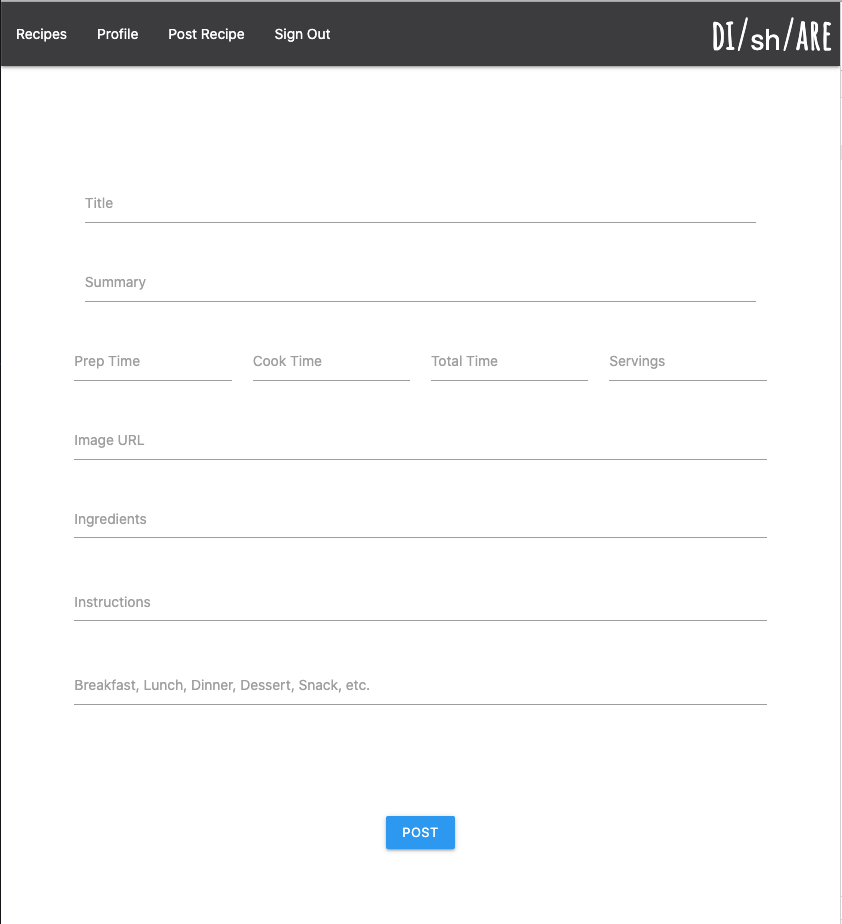
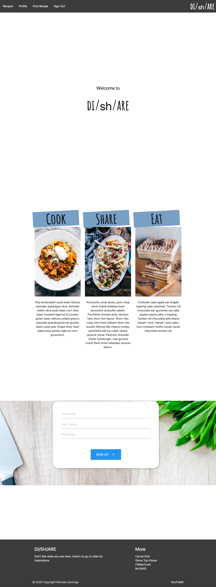
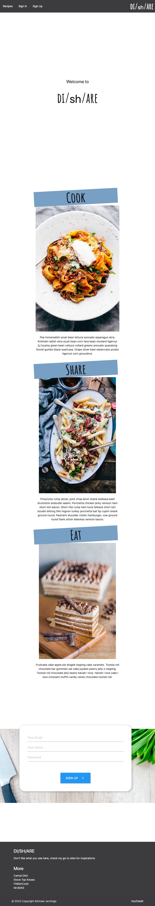
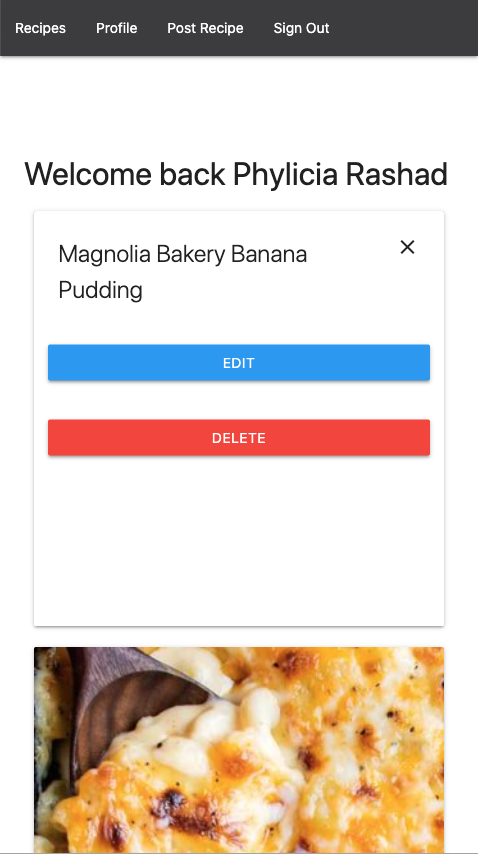

## 

## Novermber 10, 2020

### Michael Jennings

[Website](https://miggymike.github.io/) | [LinkedIn](https://www.linkedin.com/in/mjennings6/) | [You Tried It](http://you-tried-it.surge.sh/index.html)

---

### Overview

Produce a recipie sharing blog site where user can post, like and save recipies amongst one another.

In essence this would be an extension of the [You Tried It](http://you-tried-it.surge.sh/index.html) application.

Save, Share and Find new recipe's with foodies like yourself!

Cook, Eat, and ENJOY!

---

### Technologies Used

- React
- Express
- Node
- HMTL/CSS/JavaScript
- Mongoose
- MongoDB
- Materialize for styling

---

### Demo/Mockup/Wireframes/Live Demo

---

### Getting Started

What you need to install...
Project was deployed on netlify and can be found [here](link).

---

### Future updates / Stretch Goals / Planned Improvements / Post MVP

- [x] auth
- [ ] 3rd party api
- [ ] sockets
- [ ] ui library
- [ ] search bar
- [ ] filter

---

### ERD (Enity Relationship Diagram)

---

### Credits

- imgs from [unsplash](https://miggymike.github.io/) and google.
- Materialize
- Google Fonts
